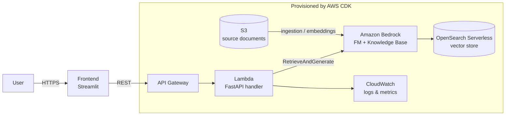

# RAGBedRockChatbot

> A production-minded Retrieval-Augmented Generation (RAG) chatbot built on **Amazon Bedrock**, deployed to AWS with Infrastructure-as-Code, automated testing, and an evaluation harness.

<!-- TODO: replace with a demo GIF once recorded -->


[](https://github.com/<your-username>/RAGBedRockChatbot/actions/workflows/ci.yml)

---

## What this is

A chatbot that answers questions over a **fixed document corpus** (default: AWS Well-Architected
whitepapers — swap in your own). It uses Amazon Bedrock Knowledge Bases for managed retrieval and a
Bedrock foundation model for generation, with **inline source citations** and an **"I don't know"
guardrail** for out-of-scope questions.

This repo is a companion to [MLOps-Pipeline](https://github.com/<your-username>/MLOps-Pipeline):
that repo covers the model lifecycle; this one covers the **GenAI application and its secure cloud
deployment**.

## Why it's not just another tutorial chatbot

| Most demos | This project |
|---|---|
| Answer with no sources | **Inline citations** to the source document + chunk |
| Hallucinate on out-of-scope questions | **Refuses** and says "I don't know" when retrieval is weak |
| Built in a notebook | **CDK Infrastructure-as-Code** + one-command teardown |
| No tests | **CI pipeline**: lint, type-check, unit tests (Bedrock mocked), `cdk synth` |
| Long-lived AWS keys in CI | **GitHub OIDC** — no static credentials |
| "Trust me, it works" | **Evaluation harness** with faithfulness / relevance metrics (see below) |

## Architecture



**Flow:** documents land in S3 → Bedrock Knowledge Base chunks + embeds them (Titan Embeddings) into
an OpenSearch Serverless vector index → at query time the Lambda calls Bedrock `RetrieveAndGenerate`,
which retrieves relevant chunks and generates a grounded, cited answer → CloudWatch captures logs and
custom metrics.

## Tech stack

- **GenAI / Retrieval:** Amazon Bedrock (Knowledge Bases, Titan Embeddings, Claude/Titan FM)
- **Vector store:** Amazon OpenSearch Serverless
- **Application:** Python, FastAPI, Streamlit
- **Compute / API:** AWS Lambda + API Gateway
- **Infrastructure-as-Code:** AWS CDK (Python)
- **Observability:** Amazon CloudWatch
- **CI/CD:** GitHub Actions (OIDC → AWS), ruff, mypy, pytest
- **Evaluation:** RAGAS-style faithfulness / answer-relevance / context-precision

## Repository layout

```
RAGBedRockChatbot/
├── app/              # FastAPI application + RAG logic + prompts
├── frontend/         # Streamlit UI
├── infra/            # AWS CDK stack (S3, Bedrock KB, OpenSearch, Lambda, API GW)
├── ingestion/        # upload docs to S3 + trigger KB sync
├── eval/             # evaluation dataset + scoring harness
├── tests/            # unit tests (Bedrock calls mocked)
├── scripts/          # helper scripts (teardown, etc.)
├── docs/             # architecture notes, diagram, demo assets
└── .github/workflows # CI + deploy pipelines
```

## Getting started

### Prerequisites
- Python 3.11+
- AWS account with Bedrock model access enabled (Titan Embeddings + your chosen FM)
- AWS CDK v2 (`npm install -g aws-cdk`)
- AWS credentials configured locally

### Setup
```bash
git clone https://github.com/<your-username>/RAGBedRockChatbot.git
cd RAGBedRockChatbot
python -m venv .venv && source .venv/bin/activate
pip install -e ".[dev]"
cp .env.example .env   # then fill in your values
```

### Deploy
```bash
# 1. Provision infrastructure
cd infra && pip install -r requirements.txt
cdk bootstrap          # first time only
cdk deploy

# 2. Upload documents and sync the knowledge base
python -m ingestion.sync_knowledge_base ./docs/corpus/

# 3. Run the frontend locally against the deployed API
streamlit run frontend/streamlit_app.py
```

### ⚠️ Cost note
Bedrock Knowledge Bases and OpenSearch Serverless **bill while running**. Tear everything down when
you're done:
```bash
./scripts/teardown.sh
```
<!-- TODO: add a rough $/day estimate here once measured -->

## Evaluation

The `eval/` harness scores answers against a small labelled dataset on three RAG dimensions:

| Metric | Meaning | Score |
|---|---|---|
| Faithfulness | Is the answer grounded in retrieved context? | _TODO_ |
| Answer relevance | Does it actually answer the question? | _TODO_ |
| Context precision | Were the retrieved chunks relevant? | _TODO_ |

```bash
python -m eval.run_eval
```
<!-- TODO: paste latest results table + commit the run output -->

## Roadmap / "how I'd extend this"

- [ ] Swap managed Knowledge Base for a **custom retrieval pipeline** (own chunking + embeddings + reranker) to demonstrate the internals
- [ ] Add conversation memory / multi-turn context
- [ ] Stream responses token-by-token
- [ ] Containerise and add an **EKS/Fargate** deployment path
- [ ] Add Bedrock Guardrails for content safety

## License
MIT — see [LICENSE](LICENSE).
